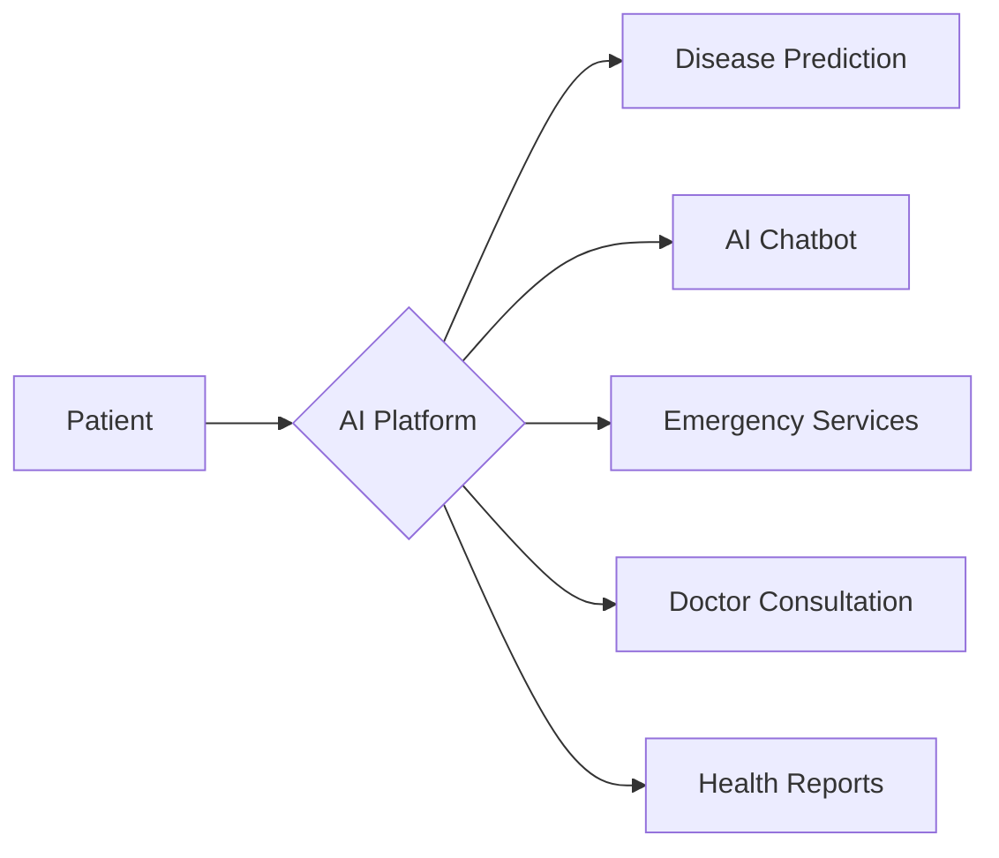
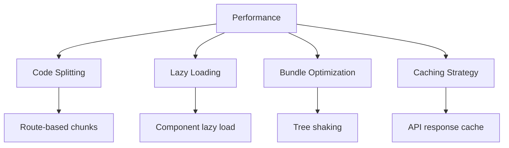

<div align="center">

# 🏥 AI Healthcare Platform

### *Intelligent Healthcare at Your Fingertips*

[](https://reactjs.org/)
[](https://vitejs.dev/)
[](https://tailwindcss.com/)
[](LICENSE)

[Features](#-features) • [Installation](#-quick-start) • [Documentation](#-documentation) • [Contributing](#-contributing)


</div>

---

## 💫 About

A cutting-edge, AI-powered healthcare platform that revolutionizes medical services through advanced technology. Built with modern web technologies, offering comprehensive solutions for disease prediction, emergency services, doctor consultations, and continuous health monitoring.

### ✨ Why Choose Our Platform?

- 🤖 **AI-Powered Intelligence** - Advanced machine learning models for accurate predictions
- ⚡ **Real-Time Services** - Instant access to emergency and consultation services
- 🎯 **User-Centric Design** - Intuitive interface designed for all age groups
- 🔒 **Secure & Private** - Enterprise-grade security for your health data
- 📱 **Fully Responsive** - Seamless experience across all devices

---

## 🌟 Features

## 🌟 Features

<table>
<tr>
<td width="50%">

### 🤖 AI-Powered Analysis
- 💓 **Cardiovascular Health** - Heart disease prediction
- 🧠 **Neurological Assessment** - Early detection systems
- 👁️ **Vision Monitoring** - Eye disease prediction
- 🫁 **Respiratory Health** - Pulmonary analysis
- 📋 **Report Intelligence** - AI-powered insights

</td>
<td width="50%">

### 👨‍⚕️ Healthcare Services
- 💬 **24/7 AI Assistant** - Google Gemini powered chatbot
- 📅 **Smart Booking** - Specialist appointments
- 🚑 **Emergency Finder** - GPS-enabled hospital search
- 📊 **Health Dashboard** - Comprehensive tracking
- 📈 **Analytics Tools** - Patient & doctor insights

</td>
</tr>
</table>

### 🚀 Core Capabilities



<details>
<summary><b>🤖 AI Chat Assistant Details</b></summary>

- 24/7 intelligent healthcare support
- Natural language processing for medical queries
- Persistent conversation history with context
- Multi-modal interface (floating & dedicated page)
- Exportable chat history for medical records
- Real-time response generation

</details>

<details>
<summary><b>🚑 Emergency Features Details</b></summary>

- Google Maps integration for hospital locations
- Automatic GPS location detection
- Direct calling to emergency services
- Real-time hospital availability data
- Wait time estimates
- Distance and route calculations

</details>

<details>
<summary><b>📊 Analytics & Insights Details</b></summary>

- Visual health trend analysis
- AI-powered personalized recommendations
- Comprehensive health report generation
- Predictive analytics for early warnings
- Interactive charts and graphs
- Export capabilities for medical professionals

</details>

---

## 🛠️ Tech Stack

<div align="center">

### Frontend


### Tools & Libraries


</div>

---

## 📁 Project Architecture

```
📦 src/
┣ 📂 components/          # Reusable React components
┃ ┣ 📂 auth/             # Authentication UI
┃ ┣ 📂 bookings/         # Appointment components
┃ ┣ 📂 dashboard/        # Dashboard widgets
┃ ┣ 📂 reports/          # Medical reports UI
┃ ┗ 📂 ui/               # Base UI components
┣ 📂 pages/              # Route pages
┃ ┣ 📂 auth/             # Login & Signup
┃ ┣ 📂 dashboard/        # User dashboards
┃ ┣ 📄 HomePage.jsx      # Landing page
┃ ┣ 📄 EmergencyPage.jsx # Emergency services
┃ ┗ 📄 ScheduleConsultationPage.jsx
┣ 📂 utils/              # Helper functions & services
┃ ┣ 📄 api.js           # API configuration
┃ ┣ 📄 chatService.js   # AI chat logic
┃ ┣ 📄 hospitalService.js # Emergency APIs
┃ ┗ 📄 patientService.js  # Patient data
┣ 📂 context/            # React Context providers
┣ 📂 hooks/              # Custom React hooks
┗ 📂 fonts/              # Typography assets
```

---

## 🚀 Quick Start

### Prerequisites

<table>
<tr>
<td>

```bash
Node.js >= 16.0.0
npm >= 8.0.0
```

</td>
<td>

```bash
Backend API
Running on :9191
```

</td>
</tr>
</table>

### Installation

```bash
# 1️⃣ Clone the repository
git clone <repository-url>
cd Frontend

# 2️⃣ Install dependencies
npm install

# 3️⃣ Setup environment variables
cp .env.example .env

# 4️⃣ Start development server
npm run dev

# 5️⃣ Open browser
# Navigate to http://localhost:5173
```

### Environment Configuration

Create a `.env` file in the root directory:

```env
VITE_API_BASE_URL=http://localhost:9191/api
VITE_GOOGLE_MAPS_API_KEY=your_google_maps_key
VITE_GEMINI_API_KEY=your_gemini_api_key
```

---

## 📜 Available Scripts

| Command | Description |
|---------|-------------|
| `npm run dev` | 🔥 Start development server with HMR |
| `npm run build` | 🏗️ Build optimized production bundle |
| `npm run preview` | 👀 Preview production build locally |
| `npm run lint` | 🔍 Run ESLint for code quality |
| `npm run format` | ✨ Format code with Prettier |

---

## 🗺️ Application Routes

<table>
<tr>
<th>Route</th>
<th>Description</th>
<th>Access</th>
</tr>
<tr>
<td><code>/</code></td>
<td>🏠 Landing page with platform overview</td>
<td>Public</td>
</tr>
<tr>
<td><code>/login</code></td>
<td>🔐 User authentication</td>
<td>Public</td>
</tr>
<tr>
<td><code>/signup</code></td>
<td>📝 User registration</td>
<td>Public</td>
</tr>
<tr>
<td><code>/emergency</code></td>
<td>🚑 Emergency hospital finder</td>
<td>Public</td>
</tr>
<tr>
<td><code>/chat</code></td>
<td>💬 AI healthcare assistant</td>
<td>Protected</td>
</tr>
<tr>
<td><code>/consultation</code></td>
<td>📅 Doctor appointment booking</td>
<td>Protected</td>
</tr>
<tr>
<td><code>/dashboard/patient</code></td>
<td>📊 Patient dashboard</td>
<td>Patient</td>
</tr>
<tr>
<td><code>/dashboard/doctor</code></td>
<td>👨‍⚕️ Doctor dashboard</td>
<td>Doctor</td>
</tr>
<tr>
<td><code>/about</code></td>
<td>ℹ️ About the platform</td>
<td>Public</td>
</tr>
<tr>
<td><code>/contact</code></td>
<td>📧 Contact information</td>
<td>Public</td>
</tr>
</table>

---

## 🔌 API Integration

<details open>
<summary><b>Backend Services</b></summary>

The frontend connects to a Node.js/Express backend providing comprehensive services:

```javascript
const API_BASE_URL = 'http://localhost:9191/api';

// Available Endpoints
📍 /api/auth/*          → Authentication & Authorization
📍 /api/patient/*       → Patient Services & Records
📍 /api/doctor/*        → Doctor Services & Management
📍 /api/hospital/*      → Emergency Services & Hospital Data
📍 /api/chat/*          → AI Chatbot Services
📍 /api/reports/*       → Medical Report Analysis
```

</details>

<details>
<summary><b>API Features</b></summary>

- ✅ JWT-based authentication
- ✅ Google Places API integration
- ✅ AI-powered medical analysis
- ✅ Real-time data synchronization
- ✅ Secure file upload/download
- ✅ WebSocket support (planned)

</details>

---

## 🎨 Design System

### Color Palette

```css
/* Primary Colors */
--pink-600: #db2777;    /* Primary Actions */
--pink-700: #be185d;    /* Hover States */

/* Accent Colors */
--blue-600: #2563eb;    /* Info & Links */
--purple-600: #9333ea;  /* AI Features */

/* Status Colors */
--green-500: #22c55e;   /* Success */
--red-500: #ef4444;     /* Error */
--yellow-500: #eab308;  /* Warning */
```

### Typography

- **Headings**: Inter, System UI
- **Body**: Default System Fonts
- **Monospace**: Fira Code, Consolas

---

## 🔐 Security Features

| Feature | Description |
|---------|-------------|
| 🛡️ **Protected Routes** | Authentication-based access control |
| 🔒 **JWT Tokens** | Secure token-based authentication |
| 🔑 **Encrypted Storage** | Secure local data encryption |
| 🚫 **CORS Protection** | Cross-origin security policies |
| ✅ **Input Validation** | Client-side form validation |
| 🍪 **Secure Cookies** | HTTPOnly & Secure flag enabled |

---

## 📱 Responsive Design

<div align="center">

| Device | Breakpoint | Status |
|--------|-----------|--------|
| 📱 Mobile | < 768px | ✅ Optimized |
| 📱 Tablet | 768px - 1024px | ✅ Optimized |
| 💻 Desktop | > 1024px | ✅ Optimized |
| 🖥️ Large Screen | > 1920px | ✅ Optimized |

</div>

### Mobile-First Features
- Touch-friendly interface
- Optimized images & assets  
- Gesture support
- PWA capabilities (planned)

---

## ⚡ Performance

### Optimization Strategies



### Metrics

- 🎯 **First Contentful Paint**: < 1.5s
- 🎯 **Time to Interactive**: < 3.0s
- 🎯 **Lighthouse Score**: 90+
- 🎯 **Bundle Size**: < 500KB (gzipped)

---

## 🧪 Testing

<table>
<tr>
<td width="50%">

### Current Status
- ⚠️ Unit Tests: Planned
- ⚠️ Integration Tests: Planned
- ⚠️ E2E Tests: Planned

</td>
<td width="50%">

### Future Stack
- Jest + React Testing Library
- Cypress for E2E
- Storybook for components

</td>
</tr>
</table>

---

## 🚀 Deployment

### Build for Production

```bash
npm run build
```

### Deployment Platforms

<div align="center">

| Platform | Status | Configuration |
|----------|--------|---------------|
|  | ✅ Recommended | Auto-deploy from Git |
|  | ✅ Supported | Drag & drop / Git |
|  | ✅ Supported | S3 + CloudFront |
|  | ✅ Supported | Container deployment |

</div>

<details>
<summary><b>Vercel Deployment</b></summary>

```bash
# Install Vercel CLI
npm i -g vercel

# Deploy
vercel --prod
```

</details>

<details>
<summary><b>Docker Deployment</b></summary>

```dockerfile
FROM node:18-alpine
WORKDIR /app
COPY package*.json ./
RUN npm ci --only=production
COPY . .
RUN npm run build
EXPOSE 5173
CMD ["npm", "run", "preview"]
```

```bash
docker build -t healthcare-frontend .
docker run -p 5173:5173 healthcare-frontend
```

</details>

---

## 📈 Roadmap

### Phase 1: Q1 2024 ✅
- [x] Core platform features
- [x] AI chatbot integration
- [x] Emergency services
- [x] Authentication system

### Phase 2: Q2 2024 🚧
- [ ] Progressive Web App (PWA)
- [ ] Push notifications
- [ ] Offline mode
- [ ] Video consultations

### Phase 3: Q3 2024 📅
- [ ] Multi-language support (i18n)
- [ ] Wearable device integration
- [ ] Advanced analytics dashboard
- [ ] Telemedicine features

### Phase 4: Q4 2024 💭
- [ ] Machine learning insights
- [ ] Blockchain health records
- [ ] AR/VR consultations
- [ ] IoT device connectivity

---

## 🤝 Contributing

We love contributions! 💙

### Quick Start

```bash
# 1. Fork & Clone
git clone https://github.com/your-username/healthcare-frontend.git

# 2. Create Branch
git checkout -b feature/amazing-feature

# 3. Commit Changes
git commit -m '✨ Add amazing feature'

# 4. Push Branch
git push origin feature/amazing-feature

# 5. Open Pull Request
```

### Contribution Guidelines

<table>
<tr>
<td>

**Code Style**
- Follow ESLint rules
- Use Prettier formatting
- Write meaningful commits
- Add JSDoc comments

</td>
<td>

**PR Requirements**
- Update documentation
- Add tests (when available)
- Screenshot for UI changes
- Link related issues

</td>
</tr>
</table>

### Commit Convention

```
✨ feat: New feature
🐛 fix: Bug fix
📝 docs: Documentation
💄 style: Styling changes
♻️ refactor: Code refactoring
⚡ perf: Performance improvement
✅ test: Testing
🔧 chore: Maintenance
```

---

## 📄 Documentation

<div align="center">

[📚 Full Documentation](docs/) • [🎨 Design System](docs/design-system.md) • [🔌 API Reference](docs/api-reference.md)

</div>

---

## 👥 Team

<table>
<tr>
<td align="center">

<br />
<b>Frontend Team</b>
<br />
⚛️ React Development
</td>
<td align="center">

<br />
<b>Backend Team</b>
<br />
🔧 API Development
</td>
<td align="center">

<br />
<b>AI/ML Team</b>
<br />
🤖 ML Models
</td>
<td align="center">

<br />
<b>Design Team</b>
<br />
🎨 UI/UX Design
</td>
</tr>
</table>

---

## 📜 License

This project is licensed under the **MIT License** - see the [LICENSE](LICENSE) file for details.

```
MIT License

Copyright (c) 2024 AI Healthcare Platform

Permission is hereby granted, free of charge, to any person obtaining a copy...
```

---

## 📞 Support & Contact

<div align="center">

### Need Help?

[](https://github.com/your-repo/issues)
[](https://discord.gg/healthcare)
[](mailto:support@healthcare.com)

### Stay Connected

[](https://twitter.com/healthcare)
[](https://linkedin.com/company/healthcare)

</div>

---

## 🙏 Acknowledgments

- React Team for the amazing framework
- Vite for blazing-fast build tool
- Tailwind CSS for utility-first CSS
- Google for Gemini AI & Maps API
- All open-source contributors

---

<div align="center">

### ⭐ Star us on GitHub!

[](https://github.com/your-repo/healthcare-frontend)

**Built with ❤️ by developers, for healthcare professionals**

*Making healthcare accessible to everyone, everywhere* 🌍

</div>
